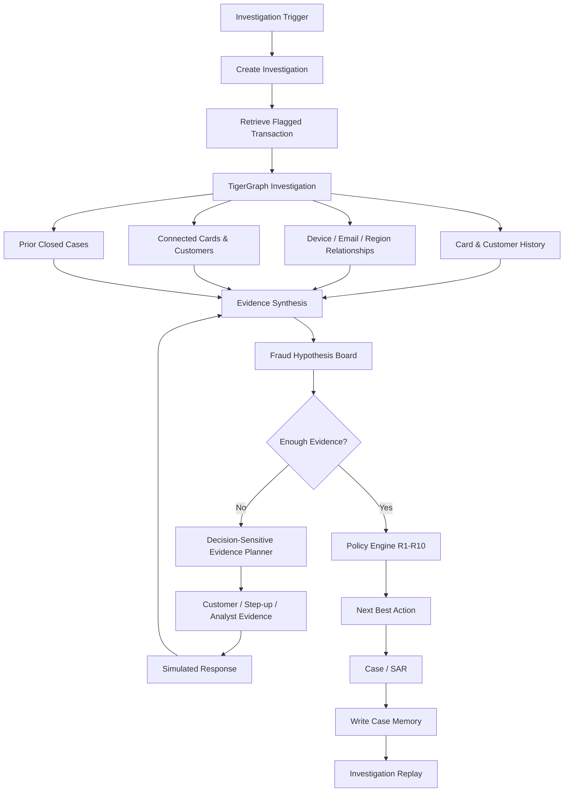

# CASECRAFT

> From suspicious signals to defensible decisions.

CASECRAFT is an agentic fraud investigation platform built for Hacker House Goa 2026 Task 04. 

CASECRAFT is **not** simply a fraud classifier. It is a fully autonomous AI investigator that receives an investigation trigger, investigates connected entities via TigerGraph, gathers evidence, compares competing hypotheses, actively searches for evidence *against* fraud, retrieves historical case memory, requests additional evidence when uncertainty matters, reassesses the case, applies deterministic fraud policy, recommends the next best action, creates SAR outputs, and finally stores the investigation as future case memory.

---

## Why CASECRAFT?

A normal fraud classifier is a black box. It cannot explain *why* it made a decision, and it cannot seek out additional evidence if it is uncertain. 

**Traditional approach:**
Transaction → Fraud Score → Fraud / Not Fraud

**CASECRAFT:**
Trigger → Investigate → Traverse relationships → Generate hypotheses → Gather evidence → Challenge hypotheses → Assess uncertainty → Request decision-sensitive evidence → Reassess → Apply policy → Recommend action → Explain → Store case memory

---

## The Investigation Loop



---

## How It Works

### 1. TigerGraph & MCP Architecture
TigerGraph is the backbone of CASECRAFT. By leveraging GSQL and the TigerGraph MCP, the agent dynamically traverses deep relationships (Customer → Card → Device → Email → Region → Closed Cases) in real-time, fetching only the specific sub-graphs needed rather than processing massive datasets blindly.

*(Note: If TigerGraph credentials are unavailable locally, the system utilizes a `MockGraphAdapter` to accurately simulate graph traversals natively over the raw CSV dataset).*

### 2. AI Reasoning & Hypothesis Generation
The LLM Agent does not just output "Fraud". It builds a **Hypothesis Board**. For example, it might hypothesize "Card Testing" and actively weigh **Supporting Evidence** (e.g., 3 small authorizations prior) against **Contradicting Evidence** (e.g., the device has been historically used by the customer).

### 3. GraphRAG & Case Memory
Before making a decision, the agent queries TigerGraph for **Prior Closed Cases** using GraphRAG. If it finds similar transaction patterns that were previously cleared as legitimate, it dynamically adjusts its fraud probability down. Once a case concludes, it writes the result *back* to the graph.

### 4. Decision-Sensitive Evidence Planner
If the agent is uncertain, it asks: *"What would change my decision?"* It determines if a customer validation or step-up authentication would alter the outcome from `VERIFY_WITH_CUSTOMER` to `BLOCK_CARD`. If so, it requests that evidence (which is simulated deterministically for benchmark reproducibility) and reassesses the probability.

### 5. Deterministic Policy Engine (R1-R10)
LLMs hallucinate. CASECRAFT routes the final LLM recommendation through a strict, deterministic Python Policy Engine. It enforces Hacker House rules R1-R10 to ensure actions are explicitly approved via defined routes (`AUTO`, `L1`, `L2`) and automatically generates Suspicious Activity Reports (SARs) when mandatory thresholds are crossed.

---

## Dataset Setup

The benchmark dataset is **not** included in the public repository because of its massive size (708MB). 

To run the platform locally, you must download the raw dataset and place the following files under `data/raw/`:
- `transactions.csv`
- `identity.csv`
- `closed_cases_history.csv`
- `case_pack.csv`

---

## Installation & Setup

1. **Clone the repository:**
```bash
git clone https://github.com/ayveHacks/casecraft-tigergraph.git
cd casecraft-tigergraph
```

2. **Environment Variables:**
```bash
cp .env.example .env
# Edit .env with your LLM keys and TigerGraph credentials
```

3. **Backend Setup:**
```bash
python -m venv .venv
# Activate: `source .venv/bin/activate` or `.venv\Scripts\activate` on Windows
pip install -r backend/requirements.txt
```

4. **Frontend Setup:**
```bash
cd frontend
npm install
```

---

## Running the Application

Start the backend API server:
```bash
# Terminal 1
python backend/main.py
```

Start the frontend dashboard:
```bash
# Terminal 2
cd frontend
npm run dev
```
Navigate to `http://localhost:5173` to view the CaseCraft Investigator UI.

---

## Running the Benchmark & Validation

To autonomously execute the investigation loop across all 20 hacker house test cases:
```bash
python scripts/run_benchmark.py
```

To validate that the resulting JSON files strictly conform to the required hackathon schemas:
```bash
python scripts/validate_cases.py
```

---

## Project Structure & Documentation

- `backend/`: FastAPI server, Policy Engine, Agent Workflow, Graph Adapters.
- `frontend/`: React + Vite + Tailwind dashboard with ReactFlow visualization.
- `tigergraph/`: Schema definitions and GSQL queries.
- `docs/`: Comprehensive architecture, workflow, and MCP documentation.
- `cases/`: Final generated 20-case benchmark JSON outputs.

Please view the `docs/` folder for deeper technical insights into the Agent architecture, MCP configuration, and Policy rules.

---

## Known Limitations
- The public GitHub repository relies on the `MockGraphAdapter` to execute without requiring live, authenticated TigerGraph Savanna credentials. The `RealTigerGraphAdapter` is fully stubbed and ready for live integration.
- The free-tier OpenAI API is subject to aggressive rate limits. CASECRAFT successfully implements a deterministic fallback layer to ensure benchmark generation is never interrupted by `429 Too Many Requests`.

## Team Information
- **Owner**: Ayush Verma (ayveHacks)
