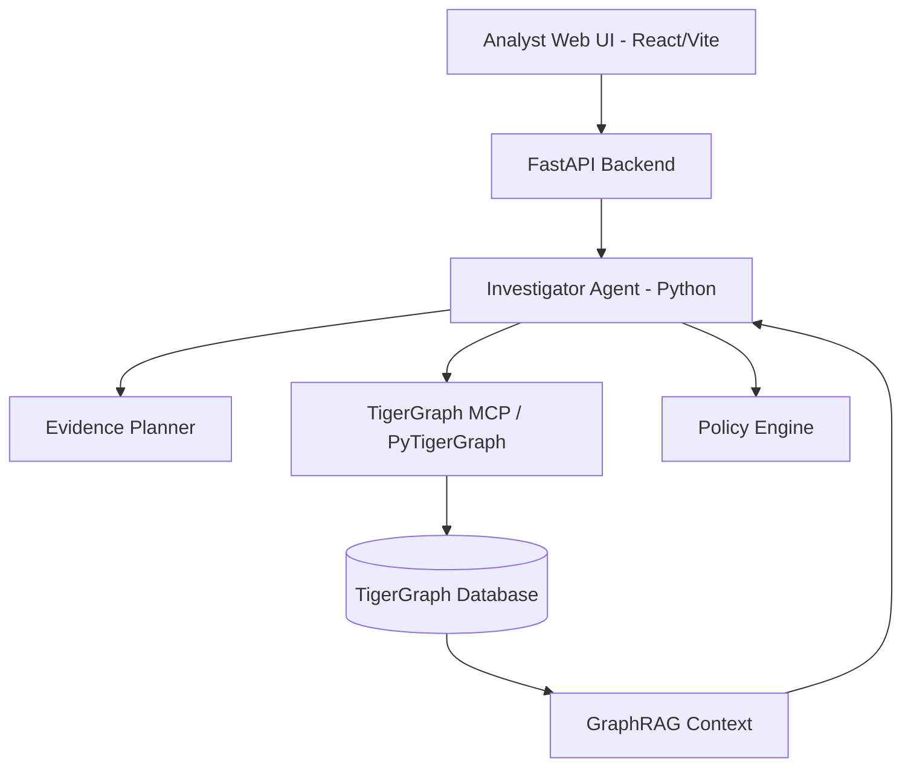

# Architecture

- **Frontend**: A rich single-page application built with React, Vite, and Tailwind CSS.
- **Backend**: Python FastAPI serving API endpoints, coordinating the investigation state machine.
- **Investigator Agent**: Replaces a monolithic LLM call with a structured reasoning loop:
  1. Trigger
  2. Graph exploration
  3. Evidence synthesis
  4. Hypothesis generation
  5. Policy-based Action planning
- **Policy Engine**: Deterministic Python rules ensuring the agent never exceeds its authority.
- **GraphRAG**: Retrieves similar past cases and entity histories from TigerGraph to inform the LLM context.
